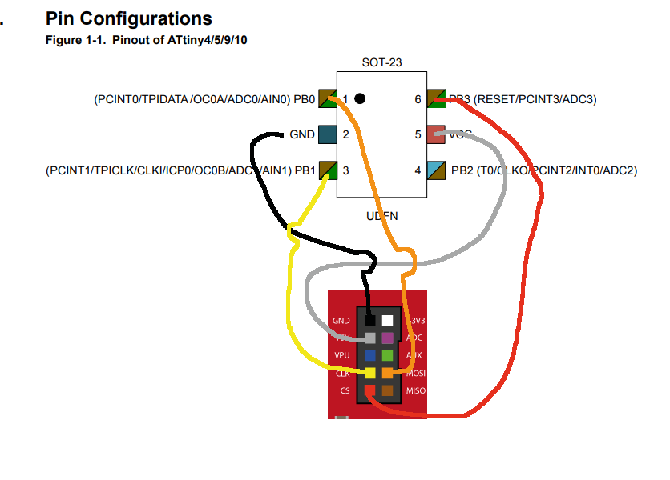
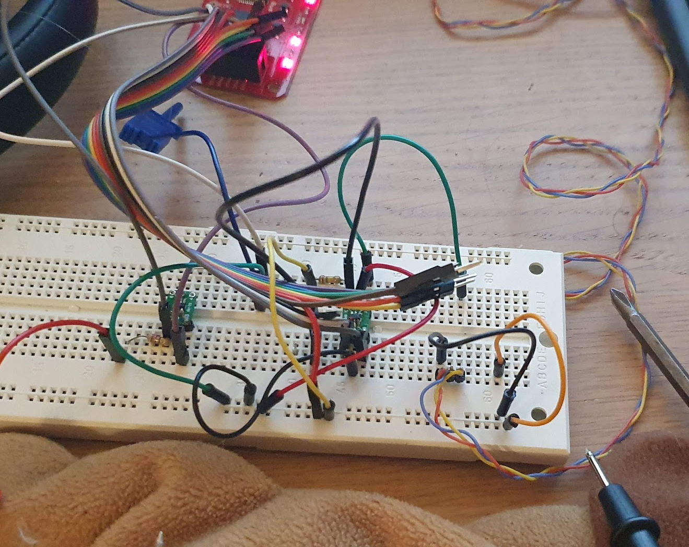

# A minimalistic example to program an attiny10 using a buspirate.

It blinks all pins, because i was hunting a cold-solder joint.
This example will only work if RESET-fuse has NOT been blown, then you need add some some external power-supply and transistors to make it output *12V* on the RESET-pin when CS is low.

the pinout used by avrdudes buspirate_bb mode is 

| BP | attiny  | attiny pin|
|----|---------|-----------|
|MOSI| TPIDATA | pin 1     |
|GND | GND     | pin 2     |
|CLK | TPICLK  | pin 3     |
|5V  | VCC     | pin 5     |
|CS  | RESET   | pin 6     |

I reccomend using a lab-dec since that makes it easy to keep track of all the connections

